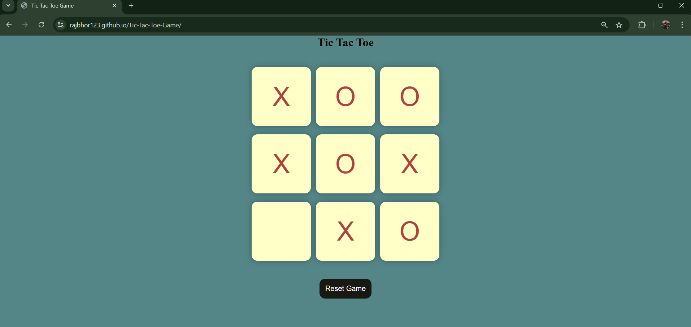

# 🎮 Tic-Tac-Toe Game

## 🏆 Overview
The **Tic-Tac-Toe Game** is a fully functional, web-based game developed using **HTML, CSS, and JavaScript**. It supports a **two-player mode**, where players take turns marking **X** or **O** on a **3x3 grid**. The game provides an **interactive UI** with smooth gameplay, winning highlights, and responsive design for a seamless experience across devices.

## 🚀 Key Features
### 🎯 Game Logic
- ✅ Implements **winning conditions** by checking rows, columns, and diagonals.
- 🤝 Detects and announces the **winner** immediately.
- 🤖 Handles **draw cases**, ensuring fairness when the grid is full without a winner.

### 🎨 Interactive UI Design
- ✨ Highlights **winning rows, columns, or diagonals** upon game completion.
- 🎮 Intuitive controls for an engaging user experience.

### 📱 Responsive Layout
- 📏 Adapts seamlessly to **desktop, tablet, and mobile devices**.
- 🖌️ Ensures smooth gameplay across various screen sizes.

### 🔄 Draw Case Handling
- ⚖ Declares a **Draw** if all grid cells are occupied and no player wins.
- 🏁 Ensures completeness and fairness in the gameplay.

## 🌍 Live Demo
🎮 **Play Now:** [Tic-Tac-Toe Game](https://rajbhor123.github.io/Tic-Tac-Toe-Game/)

## 📸 Screenshot
### 🖼️ Game Interface

---
🚀 Developed with ❤️ by [Raj Bhor]

